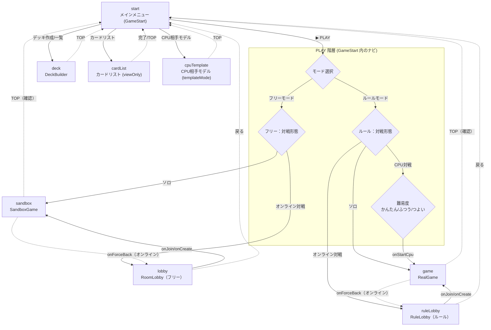
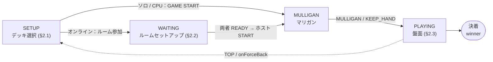

# 画面設計書 — opcg-sim-frontend

本書は `opcg-sim-frontend`（React + Vite + Pixi.js のクライアント）の**画面設計書**である。
各画面の目的・遷移・レイアウト・UI 要素・状態（条件分岐）を、画面単位でまとめる。

- システム全体の仕様は [`SPEC.md`](SPEC.md)、ユーザ目線の機能分類は
  [`user-feature-classification.md`](user-feature-classification.md) を参照。
- 画面モードの正本は `src/App.tsx` の `AppMode`。本書の「画面ID」はこれに準拠する。
- 共通モーダル／オーバーレイ（カード操作・選択・ログ等）は §10 にまとめ、各盤面画面から参照する。

---

## 0. 画面一覧と遷移

### 0.1 画面一覧

| 画面ID（AppMode） | 画面名 | 実装 | 用途 |
|---|---|---|---|
| `start` | メインメニュー | `ui/GameStart.tsx` | PLAY 階層ナビ／Deck & Cards への入口 |
| `game` | ルールモード盤面 | `screens/RealGame.tsx` | 公式ルール対局（ソロ／オンライン／CPU） |
| `sandbox` | フリーモード盤面 | `screens/SandboxGame.tsx` | ルール強制なしの自由盤面（ソロ／オンライン） |
| `lobby` | フリーモード ロビー | `screens/RoomLobby.tsx` | フリーモードのオンライン ルーム一覧／作成／参加 |
| `ruleLobby` | ルールモード ロビー | `screens/RuleLobby.tsx` | ルールモードのオンライン ルーム一覧／作成／参加 |
| `deck` | デッキビルダー | `screens/DeckBuilder.tsx` | デッキ作成・編集・一覧 |
| `cardList` | カードリスト | `screens/DeckBuilder.tsx`（`viewOnly`） | 全カードの閲覧（編集不可） |
| `cpuTemplate` | CPU相手モデル | `screens/DeckBuilder.tsx`（`templateMode`） | CPU 用テンプレデッキの登録・編集 |

ルートコンポーネント `src/App.tsx` が `mode` ステートで上記を切り替える。状態は `sessionStorage`
で復元する（リロード／クラッシュ耐性）。最上位は固定全画面コンテナ（暗色背景）＋`ErrorBoundary`。

### 0.2 画面遷移図

画面（`AppMode`）間の遷移を示す。GitHub 上では下図（Mermaid）がそのまま描画される。



- 実線＝前進遷移（メニュー選択・ロビー参加）、点線＝戻り導線。
- `sandbox`／`game` は role（`both`／`p1`／`p2`）と `vsCpu` で挙動が分岐する（§0.3・§2・§3）。
- 参考までに ASCII 版：

```
                         ┌──────────────────────────────┐
                         │        start (メインメニュー)     │
                         │  GameStart：PLAY 階層 / Deck&Cards │
                         └──────────────────────────────┘
   PLAY→モード→プレイ │            │ Deck & Cards
   ┌────────────────┼────────────┼─────────────────────┐
   │                │            │                     │
   ▼ フリー          ▼ ルール      ▼ デッキ作成/一覧        ▼ カードリスト / CPU相手モデル
 [ソロ]            [ソロ]          deck                 cardList / cpuTemplate
   │ sandbox(both)   │ game(both)
 [オンライン対戦]    [オンライン対戦]
   │                │
   ▼ lobby          ▼ ruleLobby
 RoomLobby        RuleLobby
   │ onJoin/onCreate │ onJoin/onCreate
   ▼ sandbox(p1/p2)  ▼ game(p1/p2)
                  [CPU対戦]→難易度選択
                     │ game(vsCpu)
```

戻り導線：各画面の「TOP／戻る」で `start` に戻る（盤面は確認ダイアログあり）。オンライン盤面は
`onForceBack` で対応するロビー（`lobby`／`ruleLobby`）に戻る。

### 0.3 モード × 対戦形態のマトリクス

|  | ソロ | オンライン対戦 | CPU対戦 |
|---|---|---|---|
| **フリー** | `SandboxGame`（role='both'） | `RoomLobby`→`SandboxGame`（p1/p2）+`/ws/sandbox` | — |
| **ルール** | `RealGame`（myPlayerId='both'） | `RuleLobby`→`RealGame`（p1/p2）+`/ws/game` | `RealGame`（vsCpu）+`/api/game/cpu/step` |

CPU 対戦はルールモードのみ。選択後に難易度（かんたん／ふつう／つよい）を選ぶ。

---

## 1. メインメニュー（start / GameStart）

**目的**：アプリの入口。PLAY 階層ナビ（モード→対戦形態→難易度）と「Deck & Cards」への分岐を提供。

**レイアウト**：ヘッダ（高さ 60px）／タイトル「OPCG SIM」（金色グラデーション）／中央のナビパネル
／下部の Deck & Cards グリッド。`isMobile`（幅 < 768px）でグリッドは 1 カラムに切り替わり、
コンテンツ全体がビューポートに合わせてスケールする。

```
┌──────────────────────────────────────────┐
│ [📥 一括DL(進捗)]                            │ ← ヘッダ
│              OPCG SIM                       │ ← タイトル
│            ┌───────────┐                    │
│            │  ▶ PLAY   │                    │ ← playStep='root'
│            └───────────┘                    │
│   ┌───────────────┐ ┌───────────────┐       │
│   │ デッキ作成/一覧  │ │  カードリスト    │       │ ← Deck & Cards
│   └───────────────┘ └───────────────┘       │
│   ┌───────────────┐                          │
│   │ CPU相手モデル   │                          │
│   └───────────────┘                          │
└──────────────────────────────────────────┘
```

**PLAY ナビの状態機械**（`playStep` / `playMode` / `cpuPick`）：

| 状態 | 表示 | 操作 → 次状態 |
|---|---|---|
| `root` | ▶ PLAY ボタン | PLAY → `mode` |
| `mode` | フリーモード / ルールモード + 戻る | フリー→`match(free)` / ルール→`match(rule)` |
| `match` | ソロプレイ / オンライン対戦 / CPU対戦※ + 戻る | §下表 |
| `cpuPick` | かんたん / ふつう / つよい + 戻る | 難易度選択 → CPU 対局開始 |

※「CPU対戦」はルールモード（`playMode='rule'`）のみ表示。

**UI 要素一覧**：

| 要素 | 種別 | 動作（コールバック） |
|---|---|---|
| 📥 一括DL | ボタン | 全カード画像をプリフェッチ（進捗表示。`utils/imageAssets.ts`） |
| ▶ PLAY | ボタン | `playStep='mode'` へ |
| フリーモード / ルールモード | カード | `playMode` を設定し `playStep='match'` へ |
| ソロプレイ | カード | `onStart(deckIds, mode, sbOptions)` → 盤面（`game`/`sandbox`、role='both'） |
| オンライン対戦 | カード | フリー=`onLobby()`→`lobby` ／ ルール=`onRuleLobby()`→`ruleLobby` |
| CPU対戦 | カード | `cpuPick` パネルを開く |
| かんたん/ふつう/つよい | カード | `onStartCpu(difficulty)` → ルール盤面（`vsCpu`） |
| デッキ作成/一覧 | カード | `onDeckBuilder()` → `deck` |
| カードリスト | カード | `onCardList()` → `cardList` |
| CPU相手モデル | カード | `onCpuTemplate()` → `cpuTemplate` |
| 戻る | ボタン | 一段上の `playStep` に戻る |

---

## 2. ルールモード盤面（game / RealGame）

**目的**：公式ルールエンジン（`/api/game/*`）と通信して対局を進める盤面。ソロ（ホットシート）／
オンライン対戦／CPU 対戦を `myPlayerId` と `vsCpu` で分岐する。

**フェーズ（画面状態）**：`SETUP`（デッキ選択）→（オンラインは `WAITING` ルームセットアップ）→
`MULLIGAN`（マリガン）→ `PLAYING`（盤面）。



### 2.1 セットアップ画面（ソロ／CPU）

中央カードに「VS CPU SETUP」または対局名。P1／P2 のデッキスロット（リーダー画像背景＋デッキ名、
タップで `DeckSelectModal`）、先攻選択（ソロのみ P1先攻／P2先攻トグル。ルール／CPU は「🪙 ランダム」）、
キャンセル／GAME START ボタン（デッキ未選択時 START 無効）。

| 要素 | 動作 |
|---|---|
| P1／P2 デッキスロット | タップ → `DeckSelectModal` → `p1DeckId`/`p2DeckId` 設定 |
| 先攻選択トグル | ソロのみ。先攻プレイヤーを指定 |
| GAME START | `apiClient.createGame(p1,p2,{vsCpu,cpuDifficulty,cpuDeck})` → `MULLIGAN` |
| キャンセル | `onBack()`（確認ダイアログ）→ `start` |

### 2.2 オンライン ルームセットアップ（roomStatus='WAITING'）

ルーム名（赤）／P1・P2 スロット（READY／NOT READY バッジ・デッキプレビュー）／接続インジケータ
（緑「接続中」・赤「再接続中…」）。自分のデッキ選択は `SET_DECK`、ホスト（p1）のみ START 表示
（両者 READY まで無効）。

### 2.3 盤面（roomStatus='PLAYING'）

全画面 Pixi キャンバス。中央の横線で上下に分割し、上=相手・下=自陣。`BoardSide`（`createBoardSide`）が
各サイドのゾーンを描画する。

```
┌──────────────────────────────────────────┐
│  [相手] リーダー  ステージ  キャラ×5            │
│         ライフ / デッキ / トラッシュ / ドン!!    │
│         手札（裏向き※オンライン/CPU）             │
│──────────────────────────────────────────│
│  [自陣] 手札                                  │
│         ライフ / デッキ / トラッシュ / ドン!!    │
│         キャラ×5  ステージ  リーダー   [ターン終了]│
└──────────────────────────────────────────┘
```

**盤面ゾーン**：リーダー／ステージ／キャラ場（最大 5）／手札／ライフ／デッキ／トラッシュ／ドン!!
（アクティブ・レスト・デッキ）。カードタップで `CardActionMenu` または `CardDetailSheet`。

**オーバーレイ（固定配置）**：

| オーバーレイ | 表示条件 | 内容 |
|---|---|---|
| ターン終了ボタン | 常時 | `layoutCoords` で配置。非自手番／処理待ち／CPU 思考中は無効 |
| アタック対象選択 | アタック宣言中 | 相手カードをハイライト |
| 盤面選択モード | 場から選択時 | 候補カードをハイライト＋「タップで選択」バナー |
| マリガンボタン | MULLIGAN フェーズ | MULLIGAN / KEEP_HAND |
| アクションログ | ログボタン | `ui/ActionLog.tsx`（§10.5） |
| エラートースト | エラー時 | 上部中央。5 秒で自動消去（×で手動クローズも可。§10.10） |
| 効果トースト | 主要効果発生時 | `ui/EffectToast.tsx`（§10.6） |
| コイントス | CPU／オンライン | `ui/CoinFlip.tsx`（先攻決定演出。§10.7） |

**対局中の操作（共通）**：
- 盤面ゾーン操作、カードアクション（登場／攻撃／ドン!!付与／効果起動／詳細）。
- 戦闘フロー：アタック宣言 → ブロック → カウンター → ダメージ。
- ドン!!付与：①対象タップ→「ドン!!付与」→枚数選択、②自陣アクティブドン!!タップ→対象選択→枚数選択。
- 効果処理：対象選択・任意確認・トリガー解決のオーバーレイ／`CardSelectModal`。

### 2.4 対戦形態ごとの条件分岐

| 観点 | ソロ（both） | オンライン（p1/p2） | CPU（vsCpu） |
|---|---|---|---|
| 視点 | 手番側を下に回転表示 | 自陣（`viewerId`）を下に固定 | 人間=p1 を下に固定 |
| 相手手札 | 表向き | 裏向き（`hideHand`） | 裏向き |
| 手番ゲート | なし | `isMyTurn`／`isMyDecision` | `isMyTurn`／`isMyDecision` |
| 状態同期 | ローカル | WS `STATE_UPDATE`＋相手待ち中は ~3秒ポーリング再同期 | REST のみ。`cpuStep` を 700ms ポーリング |
| TOP ボタン | `onBack`→確認→`start` | `onForceBack`→`ruleLobby` | `onBack`→`start` |

---

## 3. フリーモード盤面（sandbox / SandboxGame）

**目的**：ルール強制なしのドラッグ&ドロップ自由盤面。ソロ（role='both'）／オンライン（p1/p2）。
オンラインは `/ws/sandbox/{id}` 購読・`/api/sandbox/*`。

**セットアップ画面**：RealGame と同様（中央カードに対局名／P1・P2 デッキスロット／キャンセル・START）。
P1 は P2 を「キック」可能。

**盤面**：Pixi キャンバス上で各ゾーン間をドラッグ&ドロップ（ドロップ先は金枠でハイライト）。

| 操作 | 動作 |
|---|---|
| カード長押し（500ms） | ドラッグ開始（ゴースト表示） |
| ドロップ | `MOVE_CARD`（uuid／dest_player_id／dest_zone／index） |
| ドン!! ドラッグ | 近接のリーダー/キャラへスナップ、または don_active/don_rest/don_deck へ |
| デッキ／ライフ／トラッシュ タップ | インスペクトオーバーレイ（`InspectOverlay`、§10.8） |
| 山札/ライフへのドロップ | 「上へ置く／下へ置く」ダイアログ |
| 場 6 体目 | 入れ替え（トラッシュするキャラを選択）ダイアログ |

**上部コントロール**：「TOPへ」（確認→`start`／オンラインは `onForceBack`→`lobby`）、「リセット」（赤・初期状態へ）、
オンライン時は接続インジケータ。マリガンフェーズは P1／P2 ごとに「引き直す／完了」。

**条件分岐**：
- ローカル（both）：両者操作可。`sessionStorage` で自動復元。
- オンライン（p1/p2）：自分のゾーンのみ編集可。WS 更新。

---

## 4. フリーモード ロビー（lobby / RoomLobby）

**目的**：フリーモードのオンライン ルーム一覧・作成・参加（`/api/sandbox/*`）。

**レイアウト**：ヘッダ（← 戻る／「ROOM LOBBY」金色／更新）／ルーム作成パネル（部屋名入力＋作成ボタン）
／ルームグリッド（`auto-fill minmax(300px,1fr)`）／フッタ。WAITING のルームのみ表示。

| 要素 | 動作 |
|---|---|
| ← 戻る | `onBack()` → `start` |
| 更新 | ルーム一覧を再取得 |
| 部屋名入力 + ＋ルームを作成 | `POST /api/sandbox/create` → `onCreate(gameId)`（空欄時は無効） |
| ルームカード | `onJoin(gameId, role)`：自室／空室 → p1、既存 → p2 |

**ルームカードの状態**：満室（`active_connections>=2` 且つ非自室）は淡色＋「FULL」、自室（localStorage
`opcg_host_game` 一致）は紫枠＋「再入室」、それ以外「JOIN」。空状態は「アクションなし」。

---

## 5. ルールモード ロビー（ruleLobby / RuleLobby）

**目的**：ルールモードのオンライン ルーム一覧・作成・参加（`/api/rule/*`）。ホスト=p1、参加=p2。

RoomLobby とほぼ同一構成。差分のみ示す：

| 項目 | RoomLobby | RuleLobby |
|---|---|---|
| タイトル／配色 | 「ROOM LOBBY」金色・紫アクセント | 「RULE LOBBY」赤（#e74c3c） |
| ルームカード補助情報 | ターン数 | 接続数「接続: N/2」 |
| API | `/api/sandbox/list`・`createSandboxGame` | `/api/rule/list`・`createRuleRoom` |
| 参加コールバック | `onJoin(gameId, role)` | `onJoin(gameId, role, roomName)` |

---

## 6. デッキビルダー（deck / DeckBuilder）

**目的**：デッキの新規作成・編集・保存・削除・一覧。内部モード `list` / `edit` / `catalog`。

### 6.1 一覧（DeckListView）

ヘッダ（← TOP／「デッキ一覧」／＋新規）＋デッキカードのリスト（リーダーサムネ＋デッキ名＋枚数＋
🗑️ 削除。ローカルのみのデッキは「Local Draft」バッジ）。

| 要素 | 動作 |
|---|---|
| ← TOP | `start` へ |
| ＋新規 | 空デッキを作成し `edit` へ |
| デッキカード | `edit` へ（選択したデッキを編集） |
| 🗑️ 削除 | 確認 → `DELETE /api/deck/{id}` |

### 6.2 編集（DeckEditorView）

ヘッダ（戻る／デッキ名入力／📤 エクスポート／📊 統計／枚数／保存）。リーダー枠（タップで選択）＋
メインカードグリッド（`auto-fill minmax(80px,1fr)`、＋ボタンで追加）。カードタップで詳細オーバーレイ
（枚数増減・スワイプで隣のカードへ）。

| 要素 | 動作 |
|---|---|
| デッキ名入力 | デッキ名を編集 |
| リーダー枠 / ＋（メイン） | `catalog` を開く（`catalogMode='leader'`/`'main'`） |
| 📤 エクスポート | デッキをエクスポート（成功時に緑バナー） |
| 📊 統計 | `DeckDistributionModal`（コスト／カウンター／特徴の分布） |
| 保存 | `POST /api/deck`（templateMode は `/api/cpu_template`）→「保存しました」 |

**リーダー色制約**：メインデッキのカードはリーダーの色に一致するもののみ。

### 6.3 カタログ（CardCatalogScreen）

カードグリッド（遅延ロード・無限スクロール 300px 閾値）＋検索バー（キーワード、Enter で検索）＋
フィルタボタン（⚙️、フィルタ有効時はハイライト）→ `FilterModal`（色／コスト／パワー／種別／属性／
特徴／弾／カウンター／ブロックアイコン、所有フィルタ ALL|OWNED|NOT_OWNED、ソート、リセット／適用）。
「完了」で編集へ戻る。

- `catalogMode='leader'`：カード選択で `deck.leader_id` を更新し編集へ戻る。
- `catalogMode='main'`：カード詳細で枚数を増減。

### 6.4 派生画面（cardList / cpuTemplate）

| 画面ID | フラグ | 差分 |
|---|---|---|
| `cardList` | `viewOnly` | 全カードのカタログ閲覧。枚数ボタン非表示、所有管理 UI（localStorage `opcg_owned_cards`）あり |
| `cpuTemplate` | `templateMode` | CPU 用テンプレデッキ。保存先が `/api/cpu_template`、ラベル・保存挙動が変化 |

---

## 7〜9. （予約：将来の独立画面追加時に採番）

---

## 10. 共通モーダル／オーバーレイ

盤面画面（RealGame / SandboxGame）から呼ばれる共通 UI。表示位置・z-index は実装に従う。

### 10.0 共通デザイン基盤（ポップアップ統一）

ゲーム中のポップアップ／モーダル／バナー／トーストは、見た目（暗幕・パネル・角丸・ボタン・
重なり順）を **ダーク・グラスモーフィズム**に統一する。配色・形状・z-index は
`src/layout/layout.config.ts` のトークンを正本とし、ガワは `src/ui/common/` の共通部品を使う。

**デザイントークン**（`layout.config.ts`）：

| トークン群 | 主な値 | 用途 |
|---|---|---|
| `MODAL.SCRIM` / `MODAL.BACKDROP_BLUR` | `rgba(8,10,14,0.62)` ＋ `blur(6px)` | 全モーダル共通の暗幕 |
| `MODAL.PANEL_BG` / `PANEL_BORDER` / `PANEL_RADIUS` / `PANEL_SHADOW` | ダークグラデ・半透明白枠・16px・影 | パネル本体 |
| `MODAL.TEXT_PRIMARY` / `TEXT_MUTED` / `ACCENT` | `#f2f4f8` / `#9aa6b5` / `#ffd54d` | テキスト・見出し |
| `MODAL.BANNER_BG` / `BANNER_BLUR` / `BANNER_BORDER` | `rgba(18,22,31,0.82)` ＋ blur ＋金枠 | 細バナー |

**重なり順**（`Z_INDEX`、昇順）：`BANNER(100)` < `MINI_MENU(1500)` < `MODAL(3000)` <
`SPOTLIGHT(6000)` < `TOAST(9000)`。旧名 `NOTIFICATION`/`OVERLAY`/`SHEET` は互換 alias として残置。

**共通部品**（`src/ui/common/`）：

| 部品 | 役割 | 利用例 |
|---|---|---|
| `ModalShell` | 全画面 scrim ＋ blur ＋ ダークパネルの土台（`align='center'\|'bottom'`、タイトル／×クローズ、背景タップ） | CardSelect／CardDetail／DeckSelect／各確認ダイアログ |
| `ModalButton` | variant ベースの統一ボタン（`primary/danger/success/warning/secondary/ghost`、`disabled`、`fullWidth`） | 全モーダルのボタン |
| `PromptBanner` | 上部中央の細バナー（メッセージ＋カウンタ＋アクション、`Z_INDEX.BANNER`） | 対象選択・盤面選択・Generic Pending |
| `toastStyles` | トースト presentation（位置・配色・rise）の共通スタイル | 効果トースト・エラートースト |

### 10.1 カード操作メニュー（CardActionMenu）

タップ近傍に開くコンパクトメニュー（幅 ~170px、半透明）。`getAvailableActions()` の結果のみ表示。

| ボタン | 動作 |
|---|---|
| 登場 / 攻撃 / 効果起動 | `onAction(actionKey)` → `handleAction()` |
| ドン!!付与 | `donMode` に入り、ステッパー（[−][count][+]、可能枚数表示）→「付与する」で `ATTACH_DON` |
| 詳細 | `CardDetailSheet` を開く |

開く方向（上/下）はタップ位置で反転し、画面端でクランプ。

### 10.2 カード詳細シート（CardDetailSheet）

下部中央のモーダル。カード画像／名称／バッジ（場所・属性・特徴・凍結・能力無効）／効果テキスト／
トリガー／ステータス（POWER／COST／COUNTER）＋利用可能アクション。画像スワイプで隣カードへ。
`donMode` 時はアクションをステッパー＋「決定／キャンセル」に差し替え。`card.cards` がある場合は
複数カードのギャラリー表示。

### 10.3 カード選択モーダル（CardSelectModal）

効果の対象選択・デッキ整列・リソース選択用。候補グリッド（選択でトグル、選択中は青枠＋チェック）。

| モード | 条件 | 挙動 |
|---|---|---|
| 通常 | — | 「選択中 X/Y枚（最小 Z枚）」。条件を満たすと「決定する」有効 |
| 順序指定 | `maxSelect < 0` | 全カード選択済みでドラッグ並べ替え、①②③… バッジ |
| 位置指定 | `allowPosition` | 「デッキの上へ／下へ」（`ARRANGE_DECK`） |

選択不可カードは 0.4 不透明で「選択不可」表示。確定は `onConfirm(uuids, position?)`。

> 補足：サーバが `candidates` 実体を送らず `selectable_uuids` のみの場合、候補は両プレイヤーの全ゾーン
> （手札／場／ライフ／トラッシュ／デッキ／ドン!!／リーダー／ステージ）から実体を引く。

### 10.4 デッキ選択モーダル（DeckSelectModal）

デッキ一覧＋リーダープレビュー＋「決定」。`onSelect(deckId)`。セットアップ画面のスロットから開く。

### 10.5 アクションログ（ActionLog）

左下のポップアップ（幅 220px、等幅 11px）。「ログ (N)」ヘッダ＋イベント行（左ボーダーを種別で色分け、
PLAY=緑／ATTACK=赤／TURN_END=灰／ATTACH_DON=紫等。`success=false` は淡色）。背景タップで閉じる。

### 10.6 効果トースト（EffectToast）

上部中央（~11%）に自動フェードするバッジ（1800ms）。KO／TRASH／DISCARD／BOUNCE 等は強調（暗赤）、
DRAW／HEAL／PLAY_CARD 等は標準（暗灰）。

### 10.7 コイントス（CoinFlip）

先攻決定演出（CPU／オンラインのみ）。全画面オーバーレイで自陣（左）／相手（右）の VS 表示。
REVEAL_MS（1850ms）後に結果（先攻＝緑「先攻」、後攻＝淡色「後攻」）と「あなたの先攻／後攻」を表示し、
「ゲーム開始」ボタンを有効化。`onClose()` で閉じる。1 対局に 1 回（`coinShownRef` で再表示防止）。

### 10.8 インスペクトオーバーレイ（InspectOverlay）

デッキ／ライフ／トラッシュの中身を確認（フリーモード中心）。横スクロールのカードカルーセル
（ドラッグで自動スクロール・並べ替え）、カードごとの表/裏トグル、手札へ／トラッシュへ／ゾーンへ移動、
シャッフルのアクション。

### 10.9 盤面描画の共通部品

- **BoardSide / SandboxBoardSide**：各サイドのゾーン（リーダー・ステージ・場・手札・ライフ・トラッシュ・
  ドン!!）を Pixi コンテナとして構築。`hideHand` で相手手札を裏向き、`selectableUuids` でハイライト。
- **CardRenderer**：カード 1 枚の Pixi 描画。`is_face_up===false` で裏面、レスト時 90° 回転。

### 10.10 エラートースト（errorToast）

API 失敗・CPU エラー・サーバ接続エラー等を上部中央に表示する（`toastStyles` の error スタイル、
`Z_INDEX.TOAST`）。`useGameAction`（`game/actions.ts`）が `errorToast` 文字列 state を持ち、
**セット後 5 秒で自動消去**する（新しいエラーが来るたびタイマーを張り直す）。× ボタンでの手動
クローズも可能。効果トースト（§10.6）とは別系統で、エラーは最前面（`TOAST`）に出る。

---

## 11. 横断的な画面挙動

| 項目 | 内容 |
|---|---|
| 状態復元 | `sessionStorage`（`utils/session.ts`）でリロード／クラッシュから復帰 |
| レスポンシブ | `isMobile`（幅 < 768px）でレイアウト切替、コンテンツをビューポートにスケール |
| オフライン | PWA／Service Worker＋画像キャッシュ（`utils/imageAssets.ts`） |
| 接続状態 | オンライン盤面・ロビーで WS 接続インジケータ（接続中／再接続中）を表示 |
| 手番ゲート | オンライン／CPU で `isMyTurn`／`isMyDecision` により操作可否を制御 |

---

## 12. 関連ドキュメント

- システム仕様: [`SPEC.md`](SPEC.md)（画面モード／オンライン・CPU 対戦／API クライアント・状態同期）
- 機能分類（ユーザ目線）: [`user-feature-classification.md`](user-feature-classification.md)
- 文書索引: [`README.md`](README.md)
- バックエンド仕様: `opcg-sim-backend/docs/SPEC.md`
